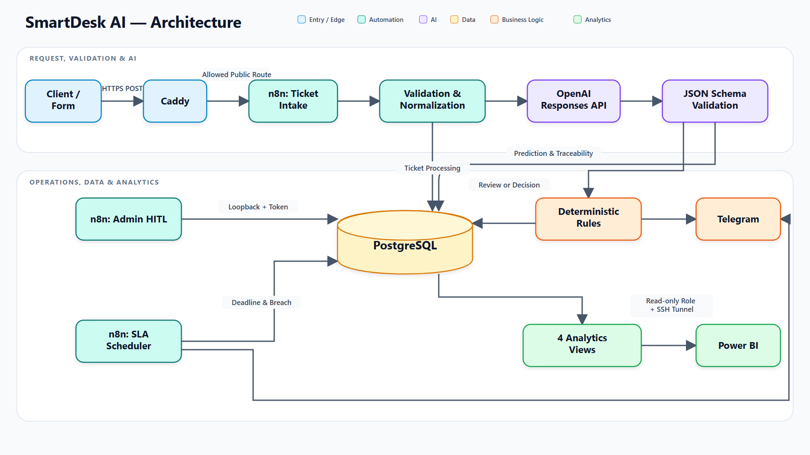
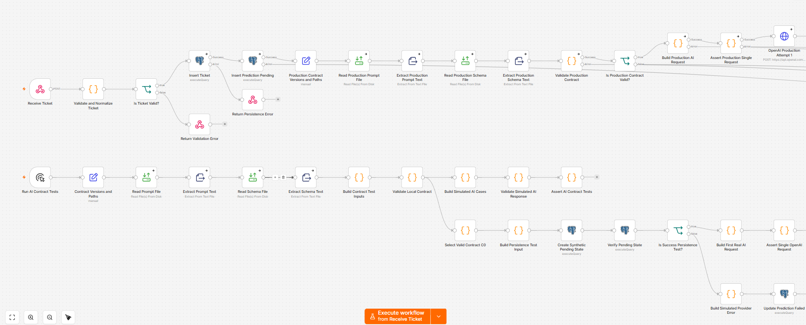
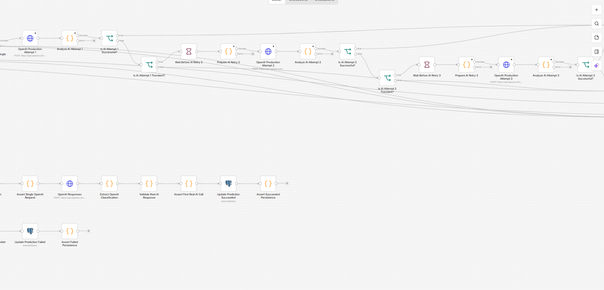
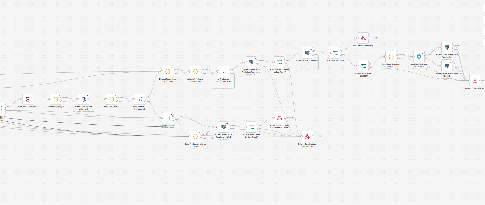
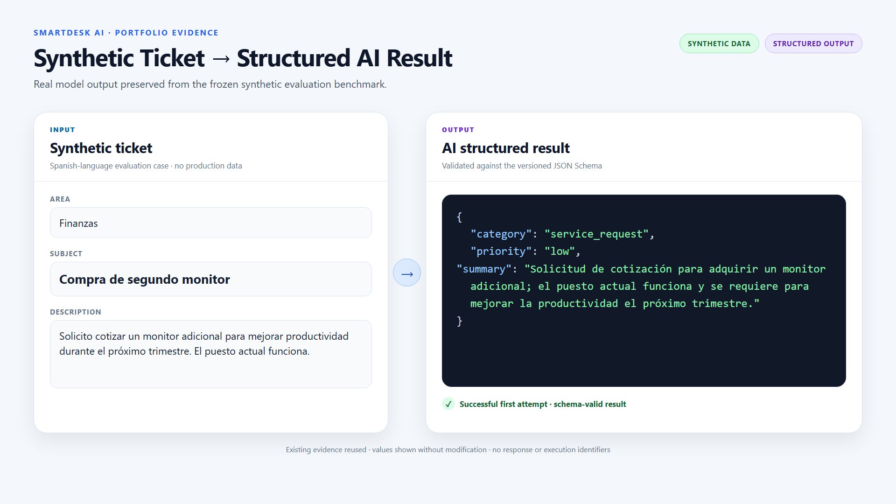
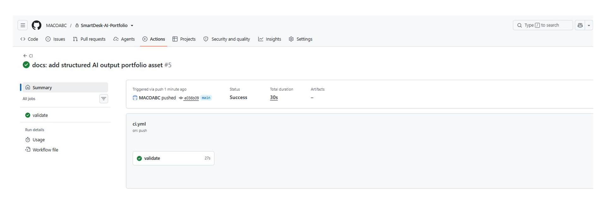
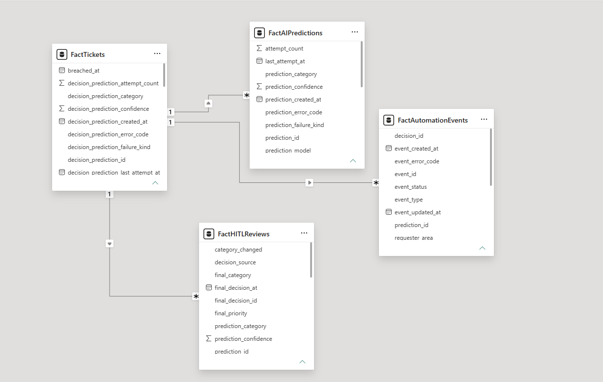

# SmartDesk AI

Mesa de ayuda asistida por IA que valida, clasifica, prioriza, persiste, enruta
y analiza tickets mediante n8n, PostgreSQL y salidas LLM estructuradas.

SmartDesk AI demuestra un flujo empresarial end-to-end desplegado y medido:
un webhook HTTPS recibe el ticket, n8n valida la entrada, PostgreSQL conserva
el estado, OpenAI produce una clasificación bajo JSON Schema, reglas
deterministas deciden la automatización y Power BI consume vistas analíticas
read-only. El proyecto incluye HITL, SLA, CI/CD, monitoring y recuperación sin
pretender sustituir una plataforma ITSM completa.

> Este repositorio es la copia sanitizada para portfolio. Conserva el código,
> la evidencia y el tag histórico `v1.0`, pero no contiene secretos ni tiene
> autoridad para desplegar o monitorizar la producción. El repositorio privado
> original sigue siendo la única autoridad operativa.

## Arquitectura



*End-to-end architecture from HTTPS ticket intake through validated AI
classification, PostgreSQL-backed automation and read-only Power BI
analytics.*

La entrada se persiste antes de llamar al proveedor de IA. Predicción,
revisión humana, decisión final, SLA y eventos se almacenan por separado para
mantener trazabilidad. La [arquitectura completa](docs/ARCHITECTURE.md) incluye
límites de red, CI/CD, monitoring y backup.

## Flujo end-to-end

```text
Ticket → validación → persistencia → clasificación estructurada
       → reglas → notificación / HITL / SLA → analytics → Power BI
```

## n8n orchestration

SmartDesk's main n8n workflow orchestrates validated ticket intake, DB-first
persistence, structured AI classification, bounded retries, review routing and
deterministic notification outcomes.

### 1. Intake and persistence

[](docs/assets/screenshots/n8n-ticket-workflow-01-intake.png)

*Ticket reception, validation, PostgreSQL persistence and preparation of the
versioned production prompt and schema. The lower lanes are isolated contract,
synthetic-case and persistence tests, not the normal production path.*

### 2. AI processing and retries

[](docs/assets/screenshots/n8n-ticket-workflow-02-ai-processing.png)

*Structured OpenAI calls with bounded retries, transient-failure decisions and
persisted success or failure outcomes.*

### 3. Classification and automation outcome

[](docs/assets/screenshots/n8n-ticket-workflow-03-outcome.png)

*Classification validation, prediction updates, HITL routing, deterministic
Telegram notification, failure handling and the final ticket response.*

The versioned [sanitized workflow export](n8n/workflows/ticket-intake.json) is
importable. Production credentials, the private route and environment-specific
configuration remain external to the repository.

### Structured AI output

[](docs/assets/screenshots/ticket-ai-response.png)

*Example synthetic ticket and the schema-validated structured result preserved
from the frozen evaluation benchmark. No production data is shown.*

## Capacidades verificadas

- contrato HTTP con validación acumulativa y persistencia DB-first;
- clasificación `category`, `priority` y `summary` bajo JSON Schema estricto;
- prompts, schemas, workflows y migraciones versionados;
- reglas deterministas y notificación Telegram con estados auditables;
- retries selectivos, recuperación de estados stale e idempotencia;
- review approve/override, decisión final separada, SLA y breaches;
- cuatro vistas analytics sin texto libre ni email;
- template Power BI de tres páginas y reconciliación SQL/DAX;
- CI con PostgreSQL temporal, CD manual por SHA, health checks y rollback;
- backup cifrado, restore aislado y copia privada off-host.

## Stack por propósito

| Área | Tecnologías |
| --- | --- |
| Orquestación | n8n, REST/webhooks |
| Datos y analytics | PostgreSQL 17, SQL, Power BI |
| IA aplicada | OpenAI Responses API, Structured Outputs, JSON Schema |
| Integraciones | Telegram |
| Plataforma | Docker Compose, Caddy, HTTPS, Oracle Cloud ARM64 |
| Calidad y operación | Python, GitHub Actions, systemd, backups cifrados |

## Evaluación de IA

La medición oficial usa un dataset **sintético, etiquetado y congelado de 120
casos**. No representa tráfico real ni impacto empresarial.

| Métrica | Resultado |
| --- | ---: |
| Clasificaciones válidas | 120/120 |
| Category accuracy | 89.17% |
| Priority accuracy | 76.67% |
| Exact match categoría + prioridad | 67.50% |
| Latencia p50 / p95 | 1504.76 ms / 4310.11 ms |
| Errores operacionales | 0/120 |

El threshold HITL productivo no derivó casos a revisión: `0/120` reviews y
`39/120` errores exactos escaparon al flujo automático. Por eso el proyecto no
afirma que confidence-based HITL mejore la precisión. Metodología, matrices,
coste y artefactos están en [Phase 7](docs/PHASE_7.md) y [eval](eval/README.md).

## Evidencia de testing

- intake: 30/30 solicitudes end-to-end;
- integridad: 27/27 checks y regresión intake 30/30;
- reglas: 19/19 validaciones deterministas;
- V1 desplegada: 6 escenarios de aceptación;
- CI: 35/35 tests offline más migraciones `001`–`005` y contratos SQL;
- GitHub Actions: PASS, fallo negativo esperado y recovery PASS;
- CD: deployment verificado por SHA completo, health check y smoke externo.

Estas cifras prueban contratos y escenarios controlados; no equivalen a
volumen de producción ni ahorro de tiempo. Las fuentes se consolidan en la
documentación de Gates y en el registro de métricas de portafolio.

[](docs/assets/screenshots/github-actions-ci.png)

*Hosted CI for the sanitized portfolio candidate, with the deterministic
validation job completed successfully.*

## Reliability y seguridad

- HTTPS termina en Caddy y solo el webhook de intake cruza el límite público.
- PostgreSQL y la administración n8n usan loopback/túnel SSH; no se exponen a
  Internet.
- Secrets y credenciales permanecen fuera de Git; `.env.example` contiene solo
  placeholders.
- El monitor hosted ejecuta un GET seguro que espera 204 y no crea tickets.
- Los backups cifrados pasaron un restore drill aislado.
- CI no llama OpenAI, Telegram ni bases productivas.

El webhook no implementa autenticación corporativa, rate limiting ni WAF. No
debe publicarse como endpoint de demo abierto.

## Analytics y Power BI

Las vistas `v_ticket_lifecycle`, `v_ai_predictions`, `v_hitl_reviews` y
`v_automation_events` exponen grains explícitos mediante un rol read-only. El
template [SmartDeskAI.pbit](powerbi/SmartDeskAI.pbit) contiene el modelo y las
tres páginas sin datos importados ni credenciales. Las cifras operacionales de
Gate 8 sirven para reconciliación técnica, no como impacto del proyecto.

[](docs/assets/screenshots/powerbi-data-model.png)

*Power BI model with active one-to-many relationships from tickets to AI
predictions, human reviews and automation events. The image contains schema
metadata only, not ticket rows.*

## Quickstart

La guía [docs/QUICKSTART.md](docs/QUICKSTART.md) cubre entorno, Compose,
migraciones, importación n8n, credenciales propias, tests, evaluación offline y
Power BI. Inicio mínimo para validación local:

```bash
cp .env.example .env
python scripts/ci/validate_repo.py
python -m unittest discover -s eval/tests -v
```

Los servicios externos requieren credenciales del usuario. No se incluye un
one-command production deploy.

## Demo

La [preparación de demo](docs/DEMO.md) y el
[script hablado](docs/DEMO_SCRIPT.md) definen un recorrido seguro de unos 3
minutos. Usa `DEMO-LOW-001` como caso principal sin notificación; los cuatro
fixtures están en [demo/tickets.json](demo/tickets.json). El recorrido
predeterminado usa evidencia estática y no depende de producción.

La [guía de assets](docs/PORTFOLIO_ASSETS.md) documenta el origen, selección y
controles de seguridad del set visual. No se incluyen mocks ni screenshots con
datos operacionales de Gate 8; la revisión del video sigue siendo manual.

## Documentación

| Tema | Fuente |
| --- | --- |
| Estado actual | [STATUS.md](STATUS.md) |
| Roadmap y gates | [ROADMAP.md](ROADMAP.md) |
| Phase 10 | [docs/PHASE_10.md](docs/PHASE_10.md) |
| Arquitectura | [docs/ARCHITECTURE.md](docs/ARCHITECTURE.md) |
| Reproducción | [docs/QUICKSTART.md](docs/QUICKSTART.md) |
| Demo segura | [docs/DEMO.md](docs/DEMO.md) |
| Script hablado | [docs/DEMO_SCRIPT.md](docs/DEMO_SCRIPT.md) |
| Claims y métricas | [docs/PORTFOLIO_METRICS.md](docs/PORTFOLIO_METRICS.md) |
| Plan de assets | [docs/PORTFOLIO_ASSETS.md](docs/PORTFOLIO_ASSETS.md) |
| Assets | [docs/assets](docs/assets) |
| Checklist de publicación | [docs/PUBLICATION_CHECKLIST.md](docs/PUBLICATION_CHECKLIST.md) |
| Release notes v1.1.0 | [docs/RELEASE_NOTES_v1.1.0.md](docs/RELEASE_NOTES_v1.1.0.md) |
| Contrato de intake | [docs/INTAKE.md](docs/INTAKE.md) |
| Evaluación | [docs/PHASE_7.md](docs/PHASE_7.md) |
| Power BI | [powerbi/README.md](powerbi/README.md) |
| Deployment | [docs/DEPLOYMENT.md](docs/DEPLOYMENT.md) |
| Operación | [docs/OPERATIONS.md](docs/OPERATIONS.md) |
| Backup/restore | [docs/BACKUP_RESTORE.md](docs/BACKUP_RESTORE.md) |
| Evidencia de Gates | [docs/testing](docs/testing) |

`STATUS.md` representa el estado vigente. Los documentos `PHASE_X` son
snapshots de implementación y `docs/testing/GATE_X` conserva evidencia.

## Limitaciones conocidas

- El benchmark es sintético y no acredita precisión en producción.
- La señal de confidence observada no discriminó los errores del benchmark.
- La arquitectura usa una sola VM y no ofrece alta disponibilidad.
- OpenAI y Telegram son dependencias externas.
- El webhook no sustituye identidad corporativa ni un portal ITSM.
- La demo pública debe operar con datos y servicios aislados.
- El environment `production` no tiene required reviewers configurados.
- La copia de portfolio omite refs operativos históricos y conserva únicamente
  la historia sanitizada de `main` y el tag `v1.0`.
- La versión histórica `v1.0` permanece intacta; `v1.1.0` está reservada
  para el futuro release de portfolio y todavía no tiene tag ni GitHub Release.

## Estado del proyecto

Gates 0–9 están aprobados. Phase 10 está en progreso y Gate 10 aún no ha sido
cerrado. No se afirman usuarios, volumen productivo, ahorro ni impacto de
negocio porque esas métricas no han sido verificadas.

## Licencia

Distribuido bajo la [MIT License](LICENSE).

