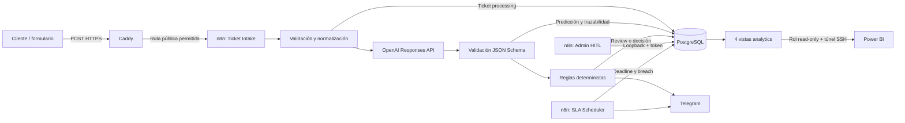
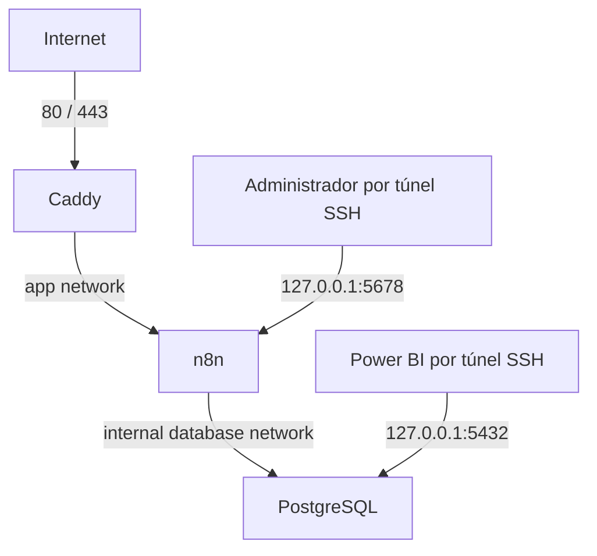
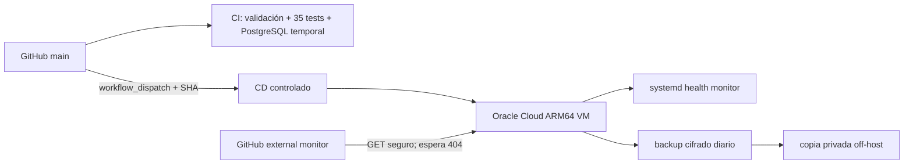

# SmartDesk AI — Arquitectura

## Flujo funcional

La solicitud se persiste antes de llamar a la IA. Una salida inválida no pasa
a las reglas. Predicción, revisión humana, decisión final, SLA y eventos se
conservan como entidades separadas para mantener auditabilidad.

## Límites de red

- Caddy solo reenvía `POST /webhook/tickets`.
- Los endpoints HITL y resolución permanecen en loopback y exigen token.
- PostgreSQL y la administración n8n no están expuestos a Internet.
- Secrets y credenciales viven fuera de Git.

## Entrega y operación

El CD es manual por SHA completo y no se ejecuta por push. El environment
`production` centraliza secrets, pero actualmente no tiene required reviewers.
Los backups se restauraron en un entorno aislado durante Gate 9.

## Componentes versionados

| Capa | Artefactos principales |
| --- | --- |
| Infraestructura | `compose.yaml`, `Caddyfile`, `ops/systemd/` |
| Orquestación | `n8n/workflows/` |
| Datos | `db/migrations/001`–`005`, `db/tests/` |
| IA | `prompts/ticket-classification/`, `eval/` |
| Analytics | `sql/analytics/`, `powerbi/SmartDeskAI.pbit` |
| Delivery | `.github/workflows/`, `scripts/ci/`, `scripts/deploy/` |
| Operación | `scripts/ops/`, `docs/OPERATIONS.md`, `docs/BACKUP_RESTORE.md` |

